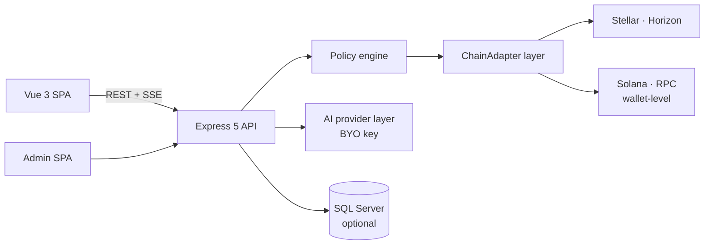

# Atrium

[](LICENSE)
[](https://github.com/Aguila1989/trader/actions)
[](https://buymeacoffee.com/aguila1989)

A self-hosted trading dashboard for the **Stellar DEX** with an optional **AI trading copilot** — bring your own LLM key, keep your own keys, run it on your own machine.

> ⚠️ **Read this first.** Atrium can move **real money on a real blockchain**. It ships in **testnet mode by default** — keep it there until you have read the safety model below and understand exactly what you're arming. This is a personal project provided **as-is, without warranty** (see [License](#license)). Nothing in this repository is financial advice, and the bundled example strategy is **not** proven profitable — the built-in backtester will tell you the same.

## What it does

- **Manual trading** on the Stellar DEX: limit orders (maker or taker), swaps via path payments, live order book, portfolio and PnL tracking, price alerts.
- **AI copilot (opt-in)**: an LLM analyses curated markets and *proposes* trades — it never signs. Every proposal passes a deterministic **policy engine** (asset whitelist, per-trade/daily caps, slippage and spread gates, exposure limits, drawdown pause, cooldowns, kill switch) before anything is submitted, and you choose manual approval or auto-approve per your risk profile.
- **Bring your own AI key**: Anthropic, OpenAI, DeepSeek, Google Gemini, OpenRouter, Groq, Mistral, xAI or Together — switchable at runtime. Local models work too (Ollama/LM Studio).
- **Risk tooling**: stop-losses (fixed + trailing) enforced by a position monitor, paper-trading mode against the live book, and a walk-forward **backtester** with honest cost modelling and significance stats.
- **Multi-chain wallets**: one wallet per chain per account — Stellar (trading) plus **Solana** (receive/hold, non-custodial only), with per-chain receive QR codes. A chain can be removed only when its wallet is verifiably empty.
- **Non-custodial mode (experimental, flag-gated)**: generate the key in your browser, the server stores only your public key, and you review + sign every transaction on your device.
- **Academy**: a built-in learning centre (37 chapters in EN/NL/FR/ES) covering Stellar, trading concepts, and every feature of the app.
- **Operator extras**: separate admin backoffice (TOTP-protected), structured trade/AI audit logs, GDPR export/delete, incident runbook, optional Stripe billing for multi-user deployments.

## Architecture



| Piece | Tech |
|---|---|
| Backend | Node 22 + TypeScript (`tsx`, no build step), Express 5 |
| Frontends | Vue 3 — main app (`web/`) + admin (`admin-web/`) |
| Persistence | SQL Server (Docker compose included); falls back to in-memory for tinkering |
| Chains | `src/chains/` adapter layer — Stellar (full trading), Solana (wallet-level); designed for more |
| AI | Native Anthropic SDK + an OpenAI-dialect client for every other provider |

## Getting started (local, testnet)

### Prerequisites

- **Node.js 22+** and npm (`node --version`)
- **Git**
- **Docker** *(optional)* — only for the local SQL Server. Without it the app runs fully **in-memory** (nothing persists across restarts — fine for a first look).

Works on Windows, macOS and Linux.

### 1. Clone and install

```bash
git clone https://github.com/Aguila1989/trader.git
cd trader
npm install                 # backend deps
npm --prefix web install    # web app deps
```

### 2. Create your `.env`

```bash
cp .env.example .env
```

Two secrets are **required** — the server refuses to start without them (each must be ≥ 32 chars). Generate them with Node (works on every OS):

```bash
node -e "console.log('JWT_SECRET=' + require('crypto').randomBytes(32).toString('hex'))"
node -e "console.log('WALLET_ENCRYPTION_KEY=' + require('crypto').randomBytes(32).toString('hex'))"
```

Paste both into `.env`. The minimum working file is:

```bash
NETWORK=testnet             # keep this until you have read the safety model
JWT_SECRET=<generated hex>
WALLET_ENCRYPTION_KEY=<generated hex>
```

> `WALLET_ENCRYPTION_KEY` encrypts wallet secrets at rest. **Back it up and keep it stable** — rotating it makes stored wallets undecryptable.

### 3. Database (optional but recommended)

With a database, trade history, PnL, daily risk counters and charts survive restarts. The repo ships a ready SQL Server container:

```bash
# in .env — pick ONE strong password and use it for both:
MSSQL_SA_PASSWORD=<a strong password>
SQLSERVER_PASSWORD=<the same password>
SQLSERVER_ENCRYPT=false          # local dev container has a self-signed cert
SQLSERVER_TRUST_CERT=true        # dev only — never in production

docker compose up -d             # starts SQL Server on :1433
npm run db:migrate               # idempotent, safe to re-run
```

Skip this entirely to run in-memory. (On **mainnet** a database is mandatory — a boot guard enforces it, because the daily loss caps must survive restarts.)

### 4. AI setup (optional — the app works without it)

Without any key, Atrium is a full manual-trading dashboard; the AI panels just stay locked. To enable the copilot, give it **any one** of the nine supported providers:

**Simplest (Anthropic is the default provider):**

```bash
ANTHROPIC_API_KEY=sk-ant-...        # from console.anthropic.com
ANTHROPIC_MODEL=claude-sonnet-4-6   # already the default
```

**Or any other provider** — set the key with its prefix, and select it with `AI_PROVIDER`:

| Provider | `AI_PROVIDER` | Key variable | Default model | Get a key at |
|---|---|---|---|---|
| Anthropic (Claude) | `anthropic` | `ANTHROPIC_API_KEY` | `claude-sonnet-4-6` | console.anthropic.com |
| OpenAI | `openai` | `OPENAI_API_KEY` | `gpt-4o` | platform.openai.com |
| DeepSeek | `deepseek` | `DEEPSEEK_API_KEY` | `deepseek-chat` | platform.deepseek.com |
| Google (Gemini) | `google` | `GOOGLE_API_KEY` | `gemini-2.5-pro` | aistudio.google.com |
| OpenRouter (any model) | `openrouter` | `OPENROUTER_API_KEY` | `anthropic/claude-sonnet-4.6` | openrouter.ai |
| Groq | `groq` | `GROQ_API_KEY` | `llama-3.3-70b-versatile` | console.groq.com |
| Mistral | `mistral` | `MISTRAL_API_KEY` | `mistral-large-latest` | console.mistral.ai |
| xAI (Grok) | `xai` | `XAI_API_KEY` | `grok-2-latest` | console.x.ai |
| Together | `together` | `TOGETHER_API_KEY` | Llama 3.3 70B Turbo | api.together.ai |

Example — run on OpenAI instead:

```bash
AI_PROVIDER=openai
OPENAI_API_KEY=sk-...
OPENAI_MODEL=gpt-4o-mini     # optional; defaults to gpt-4o
```

Useful to know:

- **Configure several keys at once** and every configured provider appears in a dashboard dropdown — switch live, no restart.
- **Per-user keys:** in a multi-user deployment each user can store their own key in *Settings → AI API key*; the server-side `.env` key is just the default.
- **Local LLM (no key, no cloud):** any OpenAI-compatible server works —
  ```bash
  AI_PROVIDER=ollama
  AI_BASE_URL=http://localhost:11434/v1
  AI_MODEL=llama3.3
  AI_API_KEY=local              # any non-empty value
  ```
- **Claude extended thinking:** `ANTHROPIC_THINKING_BUDGET=2000` makes the analyst reason before proposing (more tokens, better analysis). `0` = off (default).
- **Cost control:** the AI is only called when you click *Ask AI* / *Scan chain* — unless you set `AUTO_SCAN_INTERVAL_SECONDS>0`, which calls your provider on every scan, continuously. Start at `0`.

### 5. Run it

```bash
npm run dev        # backend (:3000) + web app, both with hot reload
```

Open **http://localhost:5175**, register an account (with SMTP unset, accounts auto-verify — no mail needed on testnet), and the app walks you into **wallet setup**:

1. Pick your chain(s) — Stellar is required; add `CHAINS=stellar,solana` to `.env` to also offer a Solana wallet (non-custodial, key generated in your browser).
2. **Create** a new Stellar wallet (write down the secret!) or **import** an existing one. Testnet wallets fund themselves with the built-in **Friendbot** button.
3. You start in **read-only** mode. Switch to **paper trading** to test strategies against the live order book with zero risk, or arm **live trading** deliberately when you mean it.

First things to try: place a manual limit order, click *Ask AI* on a pair (if you configured a key), open the *Academy* from the sidebar.

### Troubleshooting

| Symptom | Fix |
|---|---|
| Server refuses to start, names `JWT_SECRET` / `WALLET_ENCRYPTION_KEY` | Both are required, ≥ 32 chars — see step 2 |
| Server refuses to start on `NETWORK=public` | Deliberate boot guards: mainnet requires a database + SMTP (each has an explicit `ALLOW_MAINNET_WITHOUT_*` override — read `DEPLOY.md` before touching those) |
| DB connection fails against the Docker container | `SQLSERVER_ENCRYPT=false` + `SQLSERVER_TRUST_CERT=true` (self-signed dev cert), and `MSSQL_SA_PASSWORD` must equal `SQLSERVER_PASSWORD` |
| Can't log in from another machine | By design: the server binds `127.0.0.1`. Exposing it requires TLS + explicit acknowledgements — see `.env.example` (`BIND_HOST`, `ALLOW_INSECURE_EXPOSED`, `DASHBOARD_TRUSTED_ORIGINS`) |
| AI panel says no provider configured | The key must be non-empty for the **active** `AI_PROVIDER` (or add a per-user key in Settings) |

Every setting above — and ~60 more (risk limits, scanners, stop-losses, admin backoffice, Stripe, Sentry, single-user mode) — is documented inline in [`.env.example`](.env.example). That file is the configuration reference.

## The safety model, honestly

- **The AI never holds keys and never signs.** It proposes; the policy engine gates; the signer is a separate seam. Read `src/policy/engine.ts` — it's the contract.
- **Boot guards refuse dangerous configs** (mainnet without a database, without SMTP, weak secrets, exposed bind without TLS…). They exist because each one covers a real failure mode.
- **Wallet secrets are encrypted at rest** (AES-256-GCM, per-user HKDF keys) — or never leave your device at all in non-custodial mode.
- **Mainnet is opt-in and loud about it.** Before you even consider it: run the backtester on your pairs, forward-test in paper mode, read `DEPLOY.md` top to bottom, and start with money you can lose entirely.
- **Know your jurisdiction.** Self-hosting for yourself is one thing; operating this for *other people* (holding their keys, executing their trades) can make you a regulated custodian/CASP in many jurisdictions (e.g. under EU MiCA). That burden is yours.

## Development

```bash
npm run typecheck            # backend tsc
npm test                     # backend vitest suite
npm --prefix web run build   # web typecheck + build
npm run backtest             # the backtesting CLI (see --help)
```

Useful reading in-repo: [`DEPLOY.md`](DEPLOY.md) (production checklist), [`NONCUSTODIAL.md`](NONCUSTODIAL.md) (client-side signing runbook), [`INCIDENT-RESPONSE.md`](INCIDENT-RESPONSE.md), [`src/chains/README.md`](src/chains/README.md) (multi-chain design).

## Support this project

Atrium is built and maintained by one person, evenings and weekends. If it's useful to you:

**☕ [Buy me a coffee](https://buymeacoffee.com/aguila1989)**

Stars, bug reports and PRs are just as welcome.

## License

[MIT](LICENSE) © 2026 Aguila1989.

Software is provided "as is", without warranty of any kind. Trading cryptocurrencies is risky; you alone are responsible for what you configure, arm, and lose.
