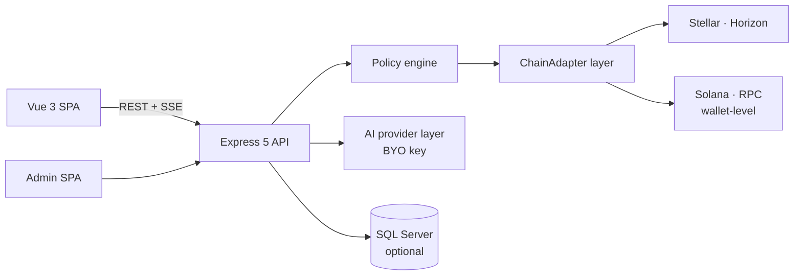

# Atrium

[](LICENSE)
[](https://github.com/Aguila1989/trader/actions)
[](https://buymeacoffee.com/aguila1989)

A self-hosted trading dashboard for the **Stellar DEX** with an optional **AI trading copilot** — bring your own LLM key, keep your own keys, run it on your own machine.

> ⚠️ **Read this first.** Atrium can move **real money on a real blockchain**. It ships in **testnet mode by default** — keep it there until you have read the safety model below and understand exactly what you're arming. This is a personal project provided **as-is, without warranty** (see [License](#license)). Nothing in this repository is financial advice, and the bundled example strategy is **not** proven profitable — the built-in backtester will tell you the same.

## What it does

- **Manual trading** on the Stellar DEX: limit orders (maker or taker), swaps via path payments, live order book, portfolio and PnL tracking, price alerts.
- **AI copilot (opt-in)**: an LLM analyses curated markets and *proposes* trades — it never signs. Every proposal passes a deterministic **policy engine** (asset whitelist, per-trade/daily caps, slippage and spread gates, exposure limits, drawdown pause, cooldowns, kill switch) before anything is submitted, and you choose manual approval or auto-approve per your risk profile.
- **Bring your own AI key**: Anthropic, OpenAI, DeepSeek, Google Gemini, OpenRouter, Groq, Mistral, xAI or Together — switchable at runtime.
- **Risk tooling**: stop-losses (fixed + trailing) enforced by a position monitor, paper-trading mode against the live book, and a walk-forward **backtester** with honest cost modelling and significance stats.
- **Multi-chain wallets**: one wallet per chain per account — Stellar (trading) plus **Solana** (receive/hold, non-custodial only), with per-chain receive QR codes. A chain can be removed only when its wallet is verifiably empty.
- **Non-custodial mode (experimental, flag-gated)**: generate the key in your browser, the server stores only your public key, and you review + sign every transaction on your device.
- **Academy**: a built-in learning centre (37 chapters in EN/NL/FR/ES) covering Stellar, trading concepts, and every feature of the app.
- **Operator extras**: separate admin backoffice (TOTP-protected), structured trade/AI audit logs, GDPR export/delete, incident runbook, optional Stripe billing for multi-user deployments.

## Architecture



| Piece | Tech |
|---|---|
| Backend | Node 22 + TypeScript (`tsx`, no build step), Express 5 |
| Frontends | Vue 3 — main app (`web/`) + admin (`admin-web/`) |
| Persistence | SQL Server (Docker compose included); falls back to in-memory for tinkering |
| Chains | `src/chains/` adapter layer — Stellar (full trading), Solana (wallet-level); designed for more |
| AI | Native Anthropic SDK + an OpenAI-dialect client for every other provider |

## Quickstart (testnet — the default)

Prereqs: Node 22+, Docker.

```bash
git clone https://github.com/Aguila1989/trader.git && cd trader
npm install
docker compose up -d            # dev SQL Server (set MSSQL_SA_PASSWORD in .env first)
cp .env.example .env            # then edit: see below
npm run db:migrate
npm run dev                     # server + web, http://localhost:5175
```

Minimum `.env` to get going (see `.env.example` for everything):

```bash
NETWORK=testnet                                  # keep this until you know better
JWT_SECRET=<openssl rand -hex 32>
WALLET_ENCRYPTION_KEY=<openssl rand -hex 32>
MSSQL_SA_PASSWORD=<a strong password>
SQLSERVER_PASSWORD=<the same password>
ANTHROPIC_API_KEY=sk-ant-...                     # optional — enables the AI copilot
```

Register an account, create or import a **testnet** wallet on the setup screen (fund it with the built-in Friendbot button), and explore. Add `CHAINS=stellar,solana` to also offer Solana wallets.

## The safety model, honestly

- **The AI never holds keys and never signs.** It proposes; the policy engine gates; the signer is a separate seam. Read `src/policy/engine.ts` — it's the contract.
- **Boot guards refuse dangerous configs** (mainnet without a database, without SMTP, weak secrets, exposed bind without TLS…). They exist because each one covers a real failure mode.
- **Wallet secrets are encrypted at rest** (AES-256-GCM, per-user HKDF keys) — or never leave your device at all in non-custodial mode.
- **Mainnet is opt-in and loud about it.** Before you even consider it: run the backtester on your pairs, forward-test in paper mode, read `DEPLOY.md` top to bottom, and start with money you can lose entirely.
- **Know your jurisdiction.** Self-hosting for yourself is one thing; operating this for *other people* (holding their keys, executing their trades) can make you a regulated custodian/CASP in many jurisdictions (e.g. under EU MiCA). That burden is yours.

## Development

```bash
npm run typecheck            # backend tsc
npm test                     # backend vitest suite
npm --prefix web run build   # web typecheck + build
npm run backtest             # the backtesting CLI
```

Useful reading in-repo: `DEPLOY.md` (production checklist), `NONCUSTODIAL.md` (client-side signing runbook), `INCIDENT-RESPONSE.md`, `src/chains/README.md` (multi-chain design).

## Support this project

Atrium is built and maintained by one person, evenings and weekends. If it's useful to you:

**☕ [Buy me a coffee](https://buymeacoffee.com/aguila1989)**

Stars, bug reports and PRs are just as welcome.

## License

[MIT](LICENSE) © 2026 Aguila1989.

Software is provided "as is", without warranty of any kind. Trading cryptocurrencies is risky; you alone are responsible for what you configure, arm, and lose.
